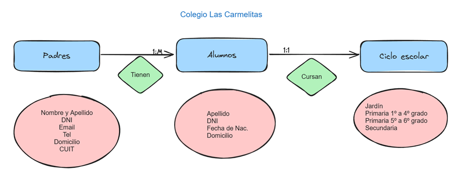

# Proyecto SQL - COLEGIO LAS CARMELITAS
## Primera entrega del trabajo realizado en el curso

- Descripción de la temática de la BD (Explicar en qué consisten las tablas y el script de la creación de la BD):
Trabajaremos sobre una base creada a partir de la información de un colegio privado, en cuyos registros se encuentra información personal de cada miembro de la institución, como ser el nombre y apellido de alumnos, docentes y padres. También se registrará los pagos de cada alumno por el esrvicio educativo y por los servicios adicionales como ser el comedor y el transporte escolar.
Los alumnos deben abonar una cuota mensual, la cual varía de acuerdo con el año en el que se encuentra cada uno.
También, se debe tener en cuenta si hay familias con más de un hijo, para así aplicar descuento.

- DER 1 y 2

